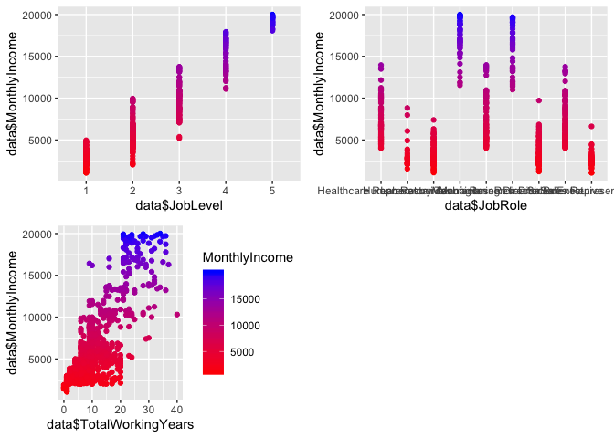
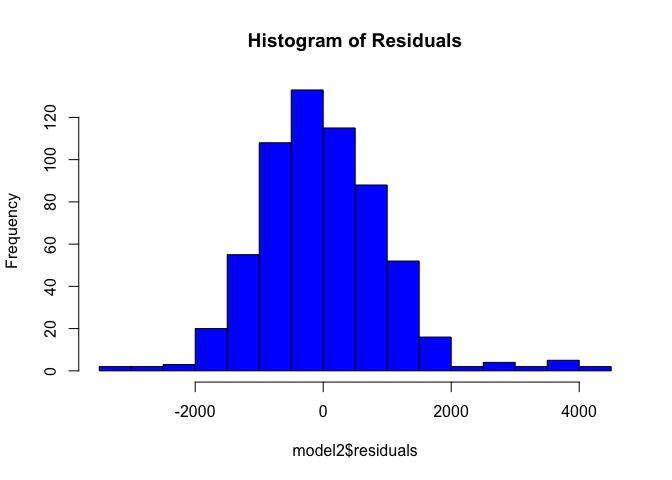
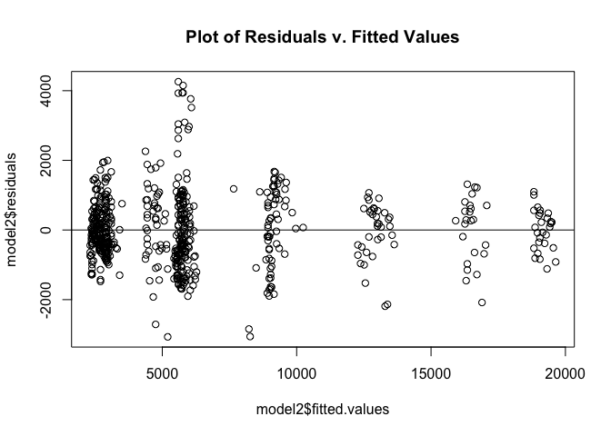
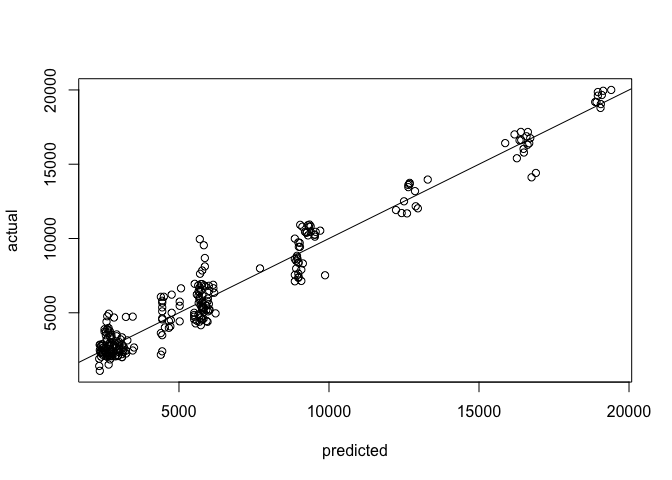

Case Study 2: Final Report
================
Sterling Beason
12/5/2019

## Executive Summary

DDSAnalytics is an analytics company that specializes in talent
management solututions for Fortune 100 companies. Frito Lay has
contracted DDSAnalytics to analyze and build models for employee
attrition and monthly income (salary). It is our privilege to present
our findings to the CEO and CFO of Frito Lay. The dataset provided by
your company included 870 observations with 36 features. We constructed
models to best predict attrition and monthly income with several
different industry standard algorithms: naive Bayes, kNN, and multiple
linear regression. Using multiple feature selection techniques; such as,
Random Forest, Multivariate Adaptive Regression (MARS), and step-wize
regression.

Top Three Predictors for Attrition: [see
visuals](#identify-top-three-attrition-predictors)

  - Overtime

  - Years With Current Manager

  - Age

Our best model for attrition utilized the naive Bayes algorithm with all
predictors. With this model, we achieved an accuracy of ~84%,
sensitivity of nearly 90%, and a specificity greater than 60%. [see
more](#naive-bayes---all-predictors-\(best\))

Top Three Predictors for Monthly Income: [see
visuals](#top-three-salary-predictors)

  - Job Level

  - Job Role

  - Total Working Years

With a root mean square deviation (RSME) of less than $1k, our best
model utilized multiple linear regression using the top three predictors
we identified. [see more](#top-three-features---mlr-\(best\))

Along with this report, we are pleased to provide back our attrition and
salary predictions for the non-labeled datasets “CaseStudy2CompSet No
Attrition.csv” and “CaseStudy2CompSet No Salary.csv”. You can find these
now labeled dataset files in the “prediction” folder accompanied by this
report.

## Dataset

**CaseStudy2-data.csv**

870 observations, 36 features

| Name                     | \- | Used |
| ------------------------ | -- | ---- |
| Age                      |    | yes  |
| Attrition                |    | yes  |
| BusinessTravel           |    | yes  |
| DailyRate                |    | yes  |
| Department               |    | yes  |
| DistanceFromHome         |    | yes  |
| Education                |    | yes  |
| EducationField           |    | yes  |
| EmployeeNumber           |    | no   |
| EnvironmentSatisfaction  |    | yes  |
| Gender                   |    | yes  |
| HourlyRate               |    | yes  |
| ID                       |    | no   |
| JobInvolvement           |    | yes  |
| JobLevel                 |    | yes  |
| JobRole                  |    | yes  |
| JobSatisfaction          |    | yes  |
| MaritalStatus            |    | yes  |
| MonthlyIncome            |    | yes  |
| MonthlyRate              |    | yes  |
| NumCompaniesWorked       |    | yes  |
| Over18                   |    | no   |
| OverTime                 |    | yes  |
| PercentSalaryHike        |    | yes  |
| PerformanceRating        |    | yes  |
| RelationshipSatisfaction |    | yes  |
| StandardHours            |    | no   |
| StockOptionLevel         |    | yes  |
| TotalWorkingYears        |    | yes  |
| TrainingTimesLastYear    |    | yes  |
| WorkLifeBalance          |    | yes  |
| YearsAtCompany           |    | yes  |
| YearsInCurrentRole       |    | yes  |
| YearsSinceLastPromotion  |    | yes  |
| YearsWithCurrManager     |    | yes  |

## Exploratory Data Analysis (EDA)

``` r
# import data
dataRaw = read.csv('./data/CaseStudy2-data.csv', header = TRUE)

# Remove columns
# Non-informative columns: ID, EmployeeNumber
# Useless columns with one value: EmployeeCount, Over18, StandardHours
data = dataRaw %>% select(-c('ID', 'EmployeeNumber', 'EmployeeCount', 'Over18', 'StandardHours'))

# convert factors that were picked up as int
data$EnvironmentSatisfaction <- factor(data$EnvironmentSatisfaction)
data$JobInvolvement <- factor(data$JobInvolvement)
data$JobLevel <- factor(data$JobLevel)
data$JobSatisfaction <- factor(data$JobSatisfaction)
data$PerformanceRating <- factor(data$PerformanceRating)
data$RelationshipSatisfaction <- factor(data$RelationshipSatisfaction)
data$WorkLifeBalance <- factor(data$WorkLifeBalance)
data$StockOptionLevel <- factor(data$StockOptionLevel)

# Create split copy of data by factor and numeric
categoricalCols = data %>% select_if(is.factor)
continuousCols = data %>% select_if(is.numeric)
```

### Visualize Numeric Correlations

``` r
continuousCols.cor = cor(continuousCols)
corrplot(continuousCols.cor)
```

<!-- -->

## Attrition Modeling

### Identify Top Three Attrition Predictors

#### Within All Predictors

``` r
mars <- earth(Attrition ~ ., data = data)
evimp <- evimp(mars)

evimp[1:3, c(3,4,6)]
```

    ##                      nsubsets       gcv       rss
    ## OverTimeYes                28 100.00000 100.00000
    ## YearsWithCurrManager       27  85.42971  88.82194
    ## Age                        26  77.53572  82.64030

#### Within Numeric Predictors

``` r
continuousColsWAttrition = continuousCols
continuousColsWAttrition$Attrition <- data$Attrition

mars <- earth(Attrition ~ ., data = continuousColsWAttrition)
evimp <- evimp(mars)

evimp[1:3, c(3,4,6)]
```

    ##                         nsubsets       gcv       rss
    ## TotalWorkingYears             10 100.00000 100.00000
    ## NumCompaniesWorked             9  65.87608  75.24012
    ## YearsSinceLastPromotion        8  54.42413  66.21463

``` r
data %>% select('TotalWorkingYears', 'NumCompaniesWorked', 'YearsSinceLastPromotion', 'Attrition') %>% ggpairs(mapping = ggplot2::aes(colour=Attrition))
```

<!-- -->

### Data Partitioning (Train/Test)

``` r
# split data into training and testing
trainInd = createDataPartition(data$Attrition, times = 1, p = 0.7, list = FALSE)

train = data[trainInd,]
test = data[-trainInd,]
```

### Naive Bayes - All Predictors (Best)

``` r
# Naive Bayes model
model <- naiveBayes(Attrition ~ ., data = train)

# Make predictions
pred <- predict(model, test)

# Confusion Matrix
confusionMatrix(table(pred, test$Attrition))
```

    ## Confusion Matrix and Statistics
    ## 
    ##      
    ## pred   No Yes
    ##   No  203  16
    ##   Yes  16  26
    ##                                           
    ##                Accuracy : 0.8774          
    ##                  95% CI : (0.8313, 0.9146)
    ##     No Information Rate : 0.8391          
    ##     P-Value [Acc > NIR] : 0.05108         
    ##                                           
    ##                   Kappa : 0.546           
    ##                                           
    ##  Mcnemar's Test P-Value : 1.00000         
    ##                                           
    ##             Sensitivity : 0.9269          
    ##             Specificity : 0.6190          
    ##          Pos Pred Value : 0.9269          
    ##          Neg Pred Value : 0.6190          
    ##              Prevalence : 0.8391          
    ##          Detection Rate : 0.7778          
    ##    Detection Prevalence : 0.8391          
    ##       Balanced Accuracy : 0.7730          
    ##                                           
    ##        'Positive' Class : No              
    ## 

### kNN - Numeric Predictors (Worst)

k = 8 was determined as the best k value after running the kNN algorithm
for 500 iterations between 1-30.

``` r
# Filter data for numeric columns
trainNum <- train %>% select_if(is.numeric)
testNum <- test %>% select_if(is.numeric)

# Append 'Attrition' column
trainNum$Attrition <- train$Attrition
testNum$Attrition <- test$Attrition

# Run the algorithm
knn <- knn(trainNum[,1:15], testNum[,1:15], trainNum$Attrition, prob = TRUE, k = 8)
# Confusion Matrix
confusionMatrix(table(knn, testNum$Attrition))
```

    ## Confusion Matrix and Statistics
    ## 
    ##      
    ## knn    No Yes
    ##   No  218  40
    ##   Yes   1   2
    ##                                          
    ##                Accuracy : 0.8429         
    ##                  95% CI : (0.793, 0.8849)
    ##     No Information Rate : 0.8391         
    ##     P-Value [Acc > NIR] : 0.474          
    ##                                          
    ##                   Kappa : 0.0689         
    ##                                          
    ##  Mcnemar's Test P-Value : 2.946e-09      
    ##                                          
    ##             Sensitivity : 0.99543        
    ##             Specificity : 0.04762        
    ##          Pos Pred Value : 0.84496        
    ##          Neg Pred Value : 0.66667        
    ##              Prevalence : 0.83908        
    ##          Detection Rate : 0.83525        
    ##    Detection Prevalence : 0.98851        
    ##       Balanced Accuracy : 0.52153        
    ##                                          
    ##        'Positive' Class : No             
    ## 

## Salary (MonthlyIncome) Modeling

### Monthly Income Histogram

``` r
hist(data$MonthlyIncome)
```

<!-- -->

### Top Three Salary Predictors

``` r
#data %>% select('MonthlyIncome', 'JobLevel', 'JobRole', 'TotalWorkingYears') %>% ggpairs(mapping = ggplot2::aes(colour=MonthlyIncome))
require(gridExtra)
```

    ## Loading required package: gridExtra

    ## 
    ## Attaching package: 'gridExtra'

    ## The following object is masked from 'package:randomForest':
    ## 
    ##     combine

    ## The following object is masked from 'package:dplyr':
    ## 
    ##     combine

``` r
# JobLevel
plot1 <- qplot(data$JobLevel, data$MonthlyIncome, data=data, colour=MonthlyIncome) + scale_colour_gradient(low="red", high="blue") + theme(legend.position="none")
# JobRole
plot2 <- qplot(data$JobRole, data$MonthlyIncome, data=data, colour=MonthlyIncome) + scale_colour_gradient(low="red", high="blue") + theme(legend.position="none")
# TotalWorkingYears
plot3 <- qplot(data$TotalWorkingYears, data$MonthlyIncome, data=data, colour=MonthlyIncome) + scale_colour_gradient(low="red", high="blue")

# plot columns
grid.arrange(plot1, plot2, plot3, ncol=2)
```

<!-- -->

### Multiple Linear Regression

#### Step-wise Regression - Feature Selection

``` r
# Adapted Source: http://r-statistics.co/Variable-Selection-and-Importance-With-R.html

base.mod <- lm(MonthlyIncome ~ 1 , data= data)  # base intercept only model
all.mod <- lm(MonthlyIncome ~ . , data= data) # full model with all predictors
stepMod <- step(base.mod, scope = list(lower = base.mod, upper = all.mod), direction = "both", trace = 0, steps = 1000)  # perform step-wise algorithm
shortlistedVars <- names(unlist(stepMod[[1]])) # get the shortlisted variable.
shortlistedVars <- shortlistedVars[!shortlistedVars %in% "(Intercept)"]  # remove intercept 
print(shortlistedVars)
```

    ##  [1] "JobLevel2"                       "JobLevel3"                      
    ##  [3] "JobLevel4"                       "JobLevel5"                      
    ##  [5] "JobRoleHuman Resources"          "JobRoleLaboratory Technician"   
    ##  [7] "JobRoleManager"                  "JobRoleManufacturing Director"  
    ##  [9] "JobRoleResearch Director"        "JobRoleResearch Scientist"      
    ## [11] "JobRoleSales Executive"          "JobRoleSales Representative"    
    ## [13] "TotalWorkingYears"               "BusinessTravelTravel_Frequently"
    ## [15] "BusinessTravelTravel_Rarely"     "DailyRate"

#### Top Three Features - MLR (Best)

``` r
# The three predictors varified from step-wise algo.
model2 <- lm(MonthlyIncome ~ JobLevel + JobRole + TotalWorkingYears, data = train)

summary(model2)
```

    ## 
    ## Call:
    ## lm(formula = MonthlyIncome ~ JobLevel + JobRole + TotalWorkingYears, 
    ##     data = train)
    ## 
    ## Residuals:
    ##     Min      1Q  Median      3Q     Max 
    ## -3068.6  -609.6   -89.9   592.2  4258.1 
    ## 
    ## Coefficients:
    ##                                Estimate Std. Error t value Pr(>|t|)    
    ## (Intercept)                    3601.529    219.779  16.387  < 2e-16 ***
    ## JobLevel2                      1655.221    171.617   9.645  < 2e-16 ***
    ## JobLevel3                      4859.835    232.015  20.946  < 2e-16 ***
    ## JobLevel4                      8354.619    345.454  24.184  < 2e-16 ***
    ## JobLevel5                     10919.880    401.469  27.200  < 2e-16 ***
    ## JobRoleHuman Resources        -1206.181    298.934  -4.035 6.17e-05 ***
    ## JobRoleLaboratory Technician  -1260.479    217.005  -5.809 1.03e-08 ***
    ## JobRoleManager                 3371.710    289.951  11.629  < 2e-16 ***
    ## JobRoleManufacturing Director   126.539    194.060   0.652    0.515    
    ## JobRoleResearch Director       3515.809    269.293  13.056  < 2e-16 ***
    ## JobRoleResearch Scientist      -945.156    216.974  -4.356 1.56e-05 ***
    ## JobRoleSales Executive           72.165    170.403   0.423    0.672    
    ## JobRoleSales Representative   -1284.065    268.660  -4.780 2.22e-06 ***
    ## TotalWorkingYears                44.502      9.461   4.704 3.18e-06 ***
    ## ---
    ## Signif. codes:  0 '***' 0.001 '**' 0.01 '*' 0.05 '.' 0.1 ' ' 1
    ## 
    ## Residual standard error: 1015 on 595 degrees of freedom
    ## Multiple R-squared:  0.9526, Adjusted R-squared:  0.9516 
    ## F-statistic: 919.6 on 13 and 595 DF,  p-value: < 2.2e-16

``` r
# residual histogram
hist(model2$residuals, col = "blue", main = "Histogram of Residuals")
```

<!-- -->

``` r
plot(model2$fitted.values,model2$residuals, main = "Plot of Residuals v. Fitted Values")
abline(a=0, b=0)
```

<!-- -->

``` r
# Make predictions
model2.fit <- predict(model2, newdata = test)

# Plot actual vs predicted
plot(model2.fit,test$MonthlyIncome, xlab="predicted", ylab="actual")
abline(a=0,b=1)
```

<!-- -->

``` r
#RSME from Metrics:: (https://www.rdocumentation.org/packages/Metrics/versions/0.1.4/topics/rmse)
rmse(test$MonthlyIncome, model2.fit)
```

    ## [1] 997.1853

#### All Features - MLR (Worst)

``` r
# MLR with all predictors used
model <- lm(MonthlyIncome ~ ., data = train)

summary(model)
```

    ## 
    ## Call:
    ## lm(formula = MonthlyIncome ~ ., data = train)
    ## 
    ## Residuals:
    ##     Min      1Q  Median      3Q     Max 
    ## -3080.8  -604.8   -42.0   528.9  4087.4 
    ## 
    ## Coefficients:
    ##                                    Estimate Std. Error t value Pr(>|t|)
    ## (Intercept)                       2.573e+03  8.266e+02   3.112  0.00195
    ## Age                               3.805e+00  6.728e+00   0.566  0.57194
    ## AttritionYes                      1.077e+02  1.408e+02   0.765  0.44459
    ## BusinessTravelTravel_Frequently   1.885e+02  1.689e+02   1.116  0.26485
    ## BusinessTravelTravel_Rarely       4.202e+02  1.419e+02   2.960  0.00321
    ## DailyRate                         1.454e-01  1.086e-01   1.339  0.18109
    ## DepartmentResearch & Development  3.192e+02  5.649e+02   0.565  0.57231
    ## DepartmentSales                  -2.166e+02  5.610e+02  -0.386  0.69960
    ## DistanceFromHome                 -5.605e+00  5.650e+00  -0.992  0.32162
    ## Education                         2.141e+01  4.480e+01   0.478  0.63285
    ## EducationFieldLife Sciences       5.218e+01  4.073e+02   0.128  0.89809
    ## EducationFieldMarketing           6.952e+01  4.362e+02   0.159  0.87343
    ## EducationFieldMedical            -9.208e+00  4.093e+02  -0.022  0.98206
    ## EducationFieldOther              -1.634e+02  4.457e+02  -0.367  0.71396
    ## EducationFieldTechnical Degree    1.265e+00  4.268e+02   0.003  0.99764
    ## EnvironmentSatisfaction2          1.862e+01  1.404e+02   0.133  0.89456
    ## EnvironmentSatisfaction3          8.049e+01  1.282e+02   0.628  0.53029
    ## EnvironmentSatisfaction4          2.227e+01  1.288e+02   0.173  0.86283
    ## GenderMale                        6.467e+00  8.908e+01   0.073  0.94215
    ## HourlyRate                       -1.228e+00  2.194e+00  -0.560  0.57586
    ## JobInvolvement2                  -2.326e+02  1.974e+02  -1.179  0.23905
    ## JobInvolvement3                  -1.898e+02  1.888e+02  -1.005  0.31529
    ## JobInvolvement4                  -1.566e+02  2.313e+02  -0.677  0.49862
    ## JobLevel2                         1.725e+03  1.845e+02   9.347  < 2e-16
    ## JobLevel3                         4.911e+03  2.466e+02  19.914  < 2e-16
    ## JobLevel4                         8.414e+03  3.651e+02  23.042  < 2e-16
    ## JobLevel5                         1.094e+04  4.237e+02  25.828  < 2e-16
    ## JobRoleHuman Resources           -8.444e+02  6.146e+02  -1.374  0.17002
    ## JobRoleLaboratory Technician     -1.249e+03  2.277e+02  -5.484 6.35e-08
    ## JobRoleManager                    3.619e+03  3.718e+02   9.734  < 2e-16
    ## JobRoleManufacturing Director     1.281e+02  2.066e+02   0.620  0.53546
    ## JobRoleResearch Director          3.527e+03  2.872e+02  12.277  < 2e-16
    ## JobRoleResearch Scientist        -9.751e+02  2.264e+02  -4.307 1.96e-05
    ## JobRoleSales Executive            5.091e+02  4.418e+02   1.152  0.24968
    ## JobRoleSales Representative      -8.137e+02  4.917e+02  -1.655  0.09851
    ## JobSatisfaction2                 -8.161e+01  1.357e+02  -0.601  0.54789
    ## JobSatisfaction3                 -1.740e+02  1.255e+02  -1.386  0.16619
    ## JobSatisfaction4                 -5.008e+00  1.246e+02  -0.040  0.96795
    ## MaritalStatusMarried              6.090e+01  1.197e+02   0.509  0.61116
    ## MaritalStatusSingle               2.138e+02  1.822e+02   1.174  0.24096
    ## MonthlyRate                      -1.973e-03  6.187e-03  -0.319  0.74989
    ## NumCompaniesWorked                1.579e+01  1.963e+01   0.805  0.42142
    ## OverTimeYes                      -3.218e+01  9.949e+01  -0.323  0.74652
    ## PercentSalaryHike                 6.518e+00  1.854e+01   0.352  0.72531
    ## PerformanceRating4               -1.970e+02  1.899e+02  -1.037  0.30013
    ## RelationshipSatisfaction2         7.129e+01  1.406e+02   0.507  0.61235
    ## RelationshipSatisfaction3        -4.151e+00  1.265e+02  -0.033  0.97384
    ## RelationshipSatisfaction4         1.218e+02  1.231e+02   0.989  0.32297
    ## StockOptionLevel1                 2.369e+02  1.421e+02   1.667  0.09605
    ## StockOptionLevel2                 2.511e+02  1.934e+02   1.298  0.19466
    ## StockOptionLevel3                 7.540e+01  2.099e+02   0.359  0.71957
    ## TotalWorkingYears                 3.582e+01  1.347e+01   2.658  0.00808
    ## TrainingTimesLastYear             5.694e+00  3.593e+01   0.158  0.87415
    ## WorkLifeBalance2                  3.968e+01  2.119e+02   0.187  0.85154
    ## WorkLifeBalance3                  1.065e+02  2.009e+02   0.530  0.59637
    ## WorkLifeBalance4                 -3.254e+01  2.321e+02  -0.140  0.88854
    ## YearsAtCompany                   -3.201e+00  1.569e+01  -0.204  0.83837
    ## YearsInCurrentRole                8.999e-01  2.076e+01   0.043  0.96543
    ## YearsSinceLastPromotion           2.303e+01  1.873e+01   1.229  0.21946
    ## YearsWithCurrManager             -2.345e+00  2.091e+01  -0.112  0.91075
    ##                                     
    ## (Intercept)                      ** 
    ## Age                                 
    ## AttritionYes                        
    ## BusinessTravelTravel_Frequently     
    ## BusinessTravelTravel_Rarely      ** 
    ## DailyRate                           
    ## DepartmentResearch & Development    
    ## DepartmentSales                     
    ## DistanceFromHome                    
    ## Education                           
    ## EducationFieldLife Sciences         
    ## EducationFieldMarketing             
    ## EducationFieldMedical               
    ## EducationFieldOther                 
    ## EducationFieldTechnical Degree      
    ## EnvironmentSatisfaction2            
    ## EnvironmentSatisfaction3            
    ## EnvironmentSatisfaction4            
    ## GenderMale                          
    ## HourlyRate                          
    ## JobInvolvement2                     
    ## JobInvolvement3                     
    ## JobInvolvement4                     
    ## JobLevel2                        ***
    ## JobLevel3                        ***
    ## JobLevel4                        ***
    ## JobLevel5                        ***
    ## JobRoleHuman Resources              
    ## JobRoleLaboratory Technician     ***
    ## JobRoleManager                   ***
    ## JobRoleManufacturing Director       
    ## JobRoleResearch Director         ***
    ## JobRoleResearch Scientist        ***
    ## JobRoleSales Executive              
    ## JobRoleSales Representative      .  
    ## JobSatisfaction2                    
    ## JobSatisfaction3                    
    ## JobSatisfaction4                    
    ## MaritalStatusMarried                
    ## MaritalStatusSingle                 
    ## MonthlyRate                         
    ## NumCompaniesWorked                  
    ## OverTimeYes                         
    ## PercentSalaryHike                   
    ## PerformanceRating4                  
    ## RelationshipSatisfaction2           
    ## RelationshipSatisfaction3           
    ## RelationshipSatisfaction4           
    ## StockOptionLevel1                .  
    ## StockOptionLevel2                   
    ## StockOptionLevel3                   
    ## TotalWorkingYears                ** 
    ## TrainingTimesLastYear               
    ## WorkLifeBalance2                    
    ## WorkLifeBalance3                    
    ## WorkLifeBalance4                    
    ## YearsAtCompany                      
    ## YearsInCurrentRole                  
    ## YearsSinceLastPromotion             
    ## YearsWithCurrManager                
    ## ---
    ## Signif. codes:  0 '***' 0.001 '**' 0.01 '*' 0.05 '.' 0.1 ' ' 1
    ## 
    ## Residual standard error: 1027 on 549 degrees of freedom
    ## Multiple R-squared:  0.9552, Adjusted R-squared:  0.9504 
    ## F-statistic: 198.6 on 59 and 549 DF,  p-value: < 2.2e-16

``` r
# test predictions
model.fit <- predict(model, newdata = test)

# RSME
rmse(test$MonthlyIncome, model.fit)
```

    ## [1] 1026.552
