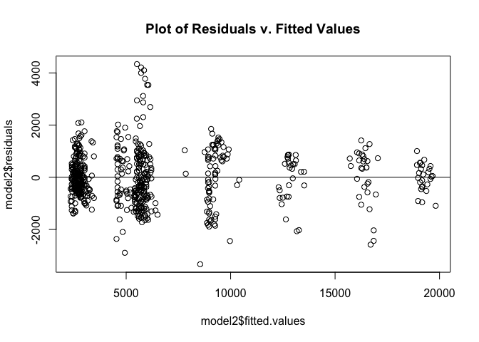
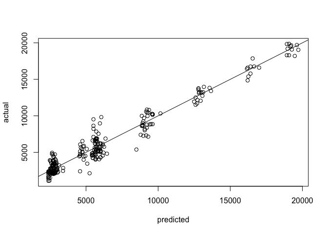

Case Study 2: Final Report
================
Sterling Beason
12/5/2019

## Executive Summary

## Dataset

870 observations, 36 features

| Name                     | \- | Used |
| ------------------------ | -- | ---- |
| Age                      |    | yes  |
| Attrition                |    | yes  |
| BusinessTravel           |    | yes  |
| DailyRate                |    | yes  |
| Department               |    | yes  |
| DistanceFromHome         |    | yes  |
| Education                |    | yes  |
| EducationField           |    | yes  |
| EmployeeNumber           |    | no   |
| EnvironmentSatisfaction  |    | yes  |
| Gender                   |    | yes  |
| HourlyRate               |    | yes  |
| ID                       |    | no   |
| JobInvolvement           |    | yes  |
| JobLevel                 |    | yes  |
| JobRole                  |    | yes  |
| JobSatisfaction          |    | yes  |
| MaritalStatus            |    | yes  |
| MonthlyIncome            |    | yes  |
| MonthlyRate              |    | yes  |
| NumCompaniesWorked       |    | yes  |
| Over18                   |    | no   |
| OverTime                 |    | yes  |
| PercentSalaryHike        |    | yes  |
| PerformanceRating        |    | yes  |
| RelationshipSatisfaction |    | yes  |
| StandardHours            |    | no   |
| StockOptionLevel         |    | yes  |
| TotalWorkingYears        |    | yes  |
| TrainingTimesLastYear    |    | yes  |
| WorkLifeBalance          |    | yes  |
| YearsAtCompany           |    | yes  |
| YearsInCurrentRole       |    | yes  |
| YearsSinceLastPromotion  |    | yes  |
| YearsWithCurrManager     |    | yes  |

## Exploratory Data Analysis (EDA)

``` r
# import data
dataRaw = read.csv('./data/CaseStudy2-data.csv', header = TRUE)

# Remove columns
# Non-informative columns: ID, EmployeeNumber
# Useless columns with one value: EmployeeCount, Over18, StandardHours
data = dataRaw %>% select(-c('ID', 'EmployeeNumber', 'EmployeeCount', 'Over18', 'StandardHours'))

# convert factors that were picked up as int
data$EnvironmentSatisfaction <- factor(data$EnvironmentSatisfaction)
data$JobInvolvement <- factor(data$JobInvolvement)
data$JobLevel <- factor(data$JobLevel)
data$JobSatisfaction <- factor(data$JobSatisfaction)
data$PerformanceRating <- factor(data$PerformanceRating)
data$RelationshipSatisfaction <- factor(data$RelationshipSatisfaction)
data$WorkLifeBalance <- factor(data$WorkLifeBalance)
data$StockOptionLevel <- factor(data$StockOptionLevel)

# Create split copy of data by factor and numeric
categoricalCols = data %>% select_if(is.factor)
continuousCols = data %>% select_if(is.numeric)
```

### Visualize numeric correlations

``` r
continuousCols.cor = cor(continuousCols)
corrplot(continuousCols.cor)
```

<!-- -->

### Identify Top Three Predictors

#### Within All Predictors

``` r
mars <- earth(Attrition ~ ., data = data)
evimp <- evimp(mars)

evimp[1:3, c(3,4,6)]
```

    ##                      nsubsets       gcv       rss
    ## OverTimeYes                28 100.00000 100.00000
    ## YearsWithCurrManager       27  85.42971  88.82194
    ## Age                        26  77.53572  82.64030

#### Within Numeric Predictors

``` r
continuousColsWAttrition = continuousCols
continuousColsWAttrition$Attrition <- data$Attrition

mars <- earth(Attrition ~ ., data = continuousColsWAttrition)
evimp <- evimp(mars)

evimp[1:3, c(3,4,6)]
```

    ##                         nsubsets       gcv       rss
    ## TotalWorkingYears             10 100.00000 100.00000
    ## NumCompaniesWorked             9  65.87608  75.24012
    ## YearsSinceLastPromotion        8  54.42413  66.21463

``` r
data %>% select('TotalWorkingYears', 'NumCompaniesWorked', 'YearsSinceLastPromotion', 'Attrition') %>% ggpairs(mapping = ggplot2::aes(colour=Attrition))
```

<!-- -->

## Attrition Modeling

### Data Partitioning (Train/Test)

``` r
# split data into training and testing
trainInd = createDataPartition(data$Attrition, times = 1, p = 0.7, list = FALSE)

train = data[trainInd,]
test = data[-trainInd,]
```

### Naive Bayes - All Predictors (Best)

``` r
# Naive Bayes model
model <- naiveBayes(Attrition ~ ., data = train)

# Make predictions
pred <- predict(model, test)

# Confusion Matrix
confusionMatrix(table(pred, test$Attrition))
```

    ## Confusion Matrix and Statistics
    ## 
    ##      
    ## pred   No Yes
    ##   No  196  21
    ##   Yes  23  21
    ##                                           
    ##                Accuracy : 0.8314          
    ##                  95% CI : (0.7804, 0.8748)
    ##     No Information Rate : 0.8391          
    ##     P-Value [Acc > NIR] : 0.6688          
    ##                                           
    ##                   Kappa : 0.3875          
    ##                                           
    ##  Mcnemar's Test P-Value : 0.8802          
    ##                                           
    ##             Sensitivity : 0.8950          
    ##             Specificity : 0.5000          
    ##          Pos Pred Value : 0.9032          
    ##          Neg Pred Value : 0.4773          
    ##              Prevalence : 0.8391          
    ##          Detection Rate : 0.7510          
    ##    Detection Prevalence : 0.8314          
    ##       Balanced Accuracy : 0.6975          
    ##                                           
    ##        'Positive' Class : No              
    ## 

### kNN - Numeric Predictors (Worst)

k = 8 was determined as the best k value after running the kNN algorithm
for 500 iterations between 1-30.

``` r
# Filter data for numeric columns
trainNum <- train %>% select_if(is.numeric)
testNum <- test %>% select_if(is.numeric)

# Append 'Attrition' column
trainNum$Attrition <- train$Attrition
testNum$Attrition <- test$Attrition

# Run the algorithm
knn <- knn(trainNum[,1:15], testNum[,1:15], trainNum$Attrition, prob = TRUE, k = 8)
# Confusion Matrix
confusionMatrix(table(knn, testNum$Attrition))
```

    ## Confusion Matrix and Statistics
    ## 
    ##      
    ## knn    No Yes
    ##   No  214  41
    ##   Yes   5   1
    ##                                         
    ##                Accuracy : 0.8238        
    ##                  95% CI : (0.772, 0.868)
    ##     No Information Rate : 0.8391        
    ##     P-Value [Acc > NIR] : 0.7782        
    ##                                         
    ##                   Kappa : 0.0015        
    ##                                         
    ##  Mcnemar's Test P-Value : 2.463e-07     
    ##                                         
    ##             Sensitivity : 0.97717       
    ##             Specificity : 0.02381       
    ##          Pos Pred Value : 0.83922       
    ##          Neg Pred Value : 0.16667       
    ##              Prevalence : 0.83908       
    ##          Detection Rate : 0.81992       
    ##    Detection Prevalence : 0.97701       
    ##       Balanced Accuracy : 0.50049       
    ##                                         
    ##        'Positive' Class : No            
    ## 

### Random Forest ???

## Salary (MonthlyIncome) Modeling

### Monthly Income Histogram

``` r
hist(data$MonthlyIncome)
```

<!-- -->

### Multiple Linear Regression

#### Step-wise Regression - Feature Selection

``` r
# Adapted Source: http://r-statistics.co/Variable-Selection-and-Importance-With-R.html

base.mod <- lm(MonthlyIncome ~ 1 , data= data)  # base intercept only model
all.mod <- lm(MonthlyIncome ~ . , data= data) # full model with all predictors
stepMod <- step(base.mod, scope = list(lower = base.mod, upper = all.mod), direction = "both", trace = 0, steps = 1000)  # perform step-wise algorithm
shortlistedVars <- names(unlist(stepMod[[1]])) # get the shortlisted variable.
shortlistedVars <- shortlistedVars[!shortlistedVars %in% "(Intercept)"]  # remove intercept 
print(shortlistedVars)
```

    ##  [1] "JobLevel2"                       "JobLevel3"                      
    ##  [3] "JobLevel4"                       "JobLevel5"                      
    ##  [5] "JobRoleHuman Resources"          "JobRoleLaboratory Technician"   
    ##  [7] "JobRoleManager"                  "JobRoleManufacturing Director"  
    ##  [9] "JobRoleResearch Director"        "JobRoleResearch Scientist"      
    ## [11] "JobRoleSales Executive"          "JobRoleSales Representative"    
    ## [13] "TotalWorkingYears"               "BusinessTravelTravel_Frequently"
    ## [15] "BusinessTravelTravel_Rarely"     "DailyRate"

#### Top Three Features - MLR

``` r
# The three predictors varified from step-wise algo.
model2 <- lm(MonthlyIncome ~ JobLevel + JobRole + TotalWorkingYears, data = train)

summary(model2)
```

    ## 
    ## Call:
    ## lm(formula = MonthlyIncome ~ JobLevel + JobRole + TotalWorkingYears, 
    ##     data = train)
    ## 
    ## Residuals:
    ##     Min      1Q  Median      3Q     Max 
    ## -3058.1  -621.6   -59.4   614.9  4205.9 
    ## 
    ## Coefficients:
    ##                                Estimate Std. Error t value Pr(>|t|)    
    ## (Intercept)                    3586.688    214.568  16.716  < 2e-16 ***
    ## JobLevel2                      1661.244    167.190   9.936  < 2e-16 ***
    ## JobLevel3                      4853.688    221.448  21.918  < 2e-16 ***
    ## JobLevel4                      8043.350    342.957  23.453  < 2e-16 ***
    ## JobLevel5                     10709.288    405.258  26.426  < 2e-16 ***
    ## JobRoleHuman Resources        -1219.301    296.130  -4.117 4.37e-05 ***
    ## JobRoleLaboratory Technician  -1183.662    211.212  -5.604 3.20e-08 ***
    ## JobRoleManager                 3380.450    296.210  11.412  < 2e-16 ***
    ## JobRoleManufacturing Director   143.335    190.586   0.752    0.452    
    ## JobRoleResearch Director       3709.735    266.994  13.894  < 2e-16 ***
    ## JobRoleResearch Scientist     -1012.733    211.770  -4.782 2.19e-06 ***
    ## JobRoleSales Executive            2.719    165.305   0.016    0.987    
    ## JobRoleSales Representative   -1177.743    268.320  -4.389 1.35e-05 ***
    ## TotalWorkingYears                51.408      9.250   5.558 4.13e-08 ***
    ## ---
    ## Signif. codes:  0 '***' 0.001 '**' 0.01 '*' 0.05 '.' 0.1 ' ' 1
    ## 
    ## Residual standard error: 1003 on 595 degrees of freedom
    ## Multiple R-squared:  0.9535, Adjusted R-squared:  0.9524 
    ## F-statistic: 937.7 on 13 and 595 DF,  p-value: < 2.2e-16

``` r
# residual histogram
hist(model2$residuals, col = "blue", main = "Histogram of Residuals")
```

<!-- -->

``` r
plot(model2$fitted.values,model2$residuals, main = "Plot of Residuals v. Fitted Values")
abline(a=0, b=0)
```

<!-- -->

``` r
# Make predictions
model2.fit <- predict(model2, newdata = test)

# Plot actual vs predicted
plot(model2.fit,test$MonthlyIncome, xlab="predicted", ylab="actual")
abline(a=0,b=1)
```

<!-- -->

``` r
#RSME from Metrics:: (https://www.rdocumentation.org/packages/Metrics/versions/0.1.4/topics/rmse)
rmse(test$MonthlyIncome, model2.fit)
```

    ## [1] 1024.516

### Random Forest
